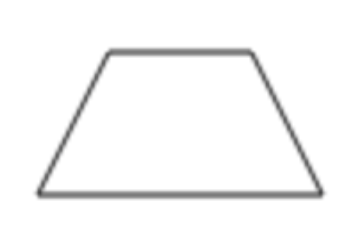
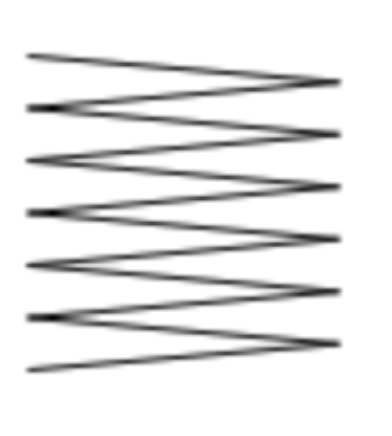

# ICS4U-3-1-The Canvas in HTML

## Learning Goals
*I can use my understanding of object-oriented programming to develop a model and a simulation.*

I can:
- [ ] Write code that meets specific requirements
- [ ] Clearly describe the function and purpose of code
- [ ] Work effectively with others
- [ ] Solve complex problems by breaking them down into simple steps I can achieve with code
- [ ] Use coding patterns to organize my thoughts and better understand the world

## Files
Within this directory you will find three sets of HTML/CSS/JS files these are:
- canvasBasics.* - an example that will be created through the video [tutorial below](#tutorial)
- 2-1-DrawingOnTheCanvas.* - a demonstration of basic drawing methods that create, fill and stroke shapes
- canvasExamples.* - a set of files to complete the drawing [challenges below](#challenges)


## The HTML Canvas Tag
We will be using the HTML5 canvas to draw on the browser screen in a similar way to Processing that we used last year.

The canvas element is a tag in html:

`<canvas id="myCanvas"></canvas>`

This tag can be accessed from JS using:

`let can = document.getElementById("myCanvas");`

The variable can now contains the canvas tag from the html, and we can then get the "context" from this element that will allow us to draw shapes/images.

`let ctx = can.getContext("2D");`

The ctx then saves an instance of the context object returned by the getContext method of the canvas object. The context object contains many drawing methods similar to Processing. New shapes are started by ctx.beginPath(); and finished by using ctx.stroke(); or ctx.fill() to fill in or outline the shape made after beginPath()
```
ctx.beginPath();
ctx.arc(100, 50, 20, 0, 2 * Math.PI);
ctx.fill();
```

## Tutorial
Starting with the attached files *canvasBasics.html* and *canvasBasics.js* complete the [tutorial video here](https://drive.google.com/file/d/1QK1tx6S5EpAwCeQPvD8_Uw-kyfkLUr0w/view?usp=sharing) that shows how to draw a jack o' lantern.

**NOTE: The above video was created for a different editor/coding environment. Please ignore the first couple of minutes setting up in github, we will learn these tools later in the course.**

## Drawing Methods

Using the files 2-1-DrawingOnTheCanvas.* observe how shapes can be created on the canvas using the drawing methods included in HTML5. Open the files, observe how shapes are created, and add a shape of your own, using at least one new method found from the [resources below](#resources).

## Challenges

See the attached files *canvasExample.html* and *canvasExample.js* for a examples and a series of challenges using the HTML canvas.

### Challenge 1
Draw this image on the 5th canvas


### Challenge 2
Draw this image on the 6th canvas


### Challenge 3
Draw this image on the 7th canvas (hint: using translate, rotate and bezier would help!)


### Challenge 4
Choose one of the drawings above, and animate this drawing instead of the circle that is shown bouncing on the 4th canvas. Draw this animation on the 8th canvas.

## Resources
[W3Schools reference for the HTML canvas](https://www.w3schools.com/tags/ref_canvas.asp)

[Mozilla Developer reference for the HTML Canvas](https://developer.mozilla.org/en-US/docs/Web/API/Canvas_API)

[Mozilla Developer canvas tutorial](https://developer.mozilla.org/en-US/docs/Web/API/Canvas_API/Tutorial)

[The Canvas Handbook (single page full reference, searchable)](https://bucephalus.org/text/CanvasHandbook/CanvasHandbook.html)